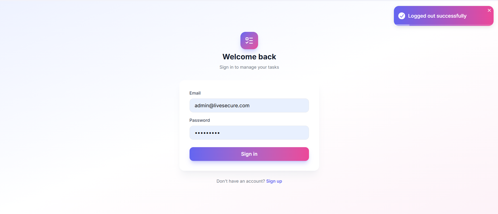
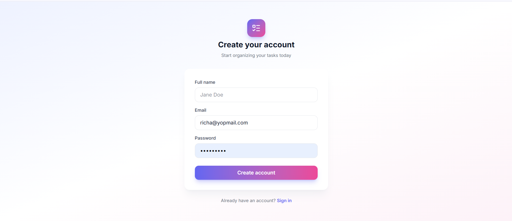

# Task Management App

A full-stack task management application with JWT authentication, built with NestJS, MongoDB, React, and TypeScript.

## Tech Stack

**Backend:** NestJS, MongoDB (Mongoose), Passport JWT, class-validator, bcrypt
**Frontend:** React, TypeScript, Vite, TanStack Query, React Hook Form + Yup, Tailwind CSS v4, Framer Motion, React Toastify

## Features

- JWT-based authentication (register/login/logout) with tokens stored in HTTP-only cookies
- Full task CRUD (create, read, update, delete)
- Mark tasks as completed with optimistic UI updates
- Filter tasks by status (All / Pending / Completed) with live counts
- Sortable task table (title, status, created date)
- Relative timestamps ("2 hours ago")
- Form validation with inline error messages
- Toast notifications for all actions
- Responsive, animated UI with a custom gradient theme
- Pagination support on the tasks API




## Project Structure

```
task-management-app/
├── backend/                  # NestJS REST API
│   └── src/
│       ├── auth/              # JWT strategy, guards, register/login/logout, /auth/me
│       ├── users/              # User schema and data access
│       ├── tasks/               # Task schema, CRUD, ownership checks
│       └── app.module.ts
└── frontend/                  # React + TypeScript client
    └── src/
        ├── api/                 # Axios instance and API call wrappers
        ├── components/          # UI primitives, layout, task components
        ├── context/             # AuthContext
        ├── hooks/               # useAuth, useTasks (React Query)
        ├── pages/               # Login, Register, Dashboard
        ├── types/               # Shared TypeScript types
        └── utils/               # Validation schemas
```

## Setup Instructions

### Prerequisites

- Node.js 18+
- MongoDB running locally, or a MongoDB Atlas connection string

### Backend

```bash
cd backend
npm install
cp .env.example .env
```

Fill in `.env` with your values (see [Environment Variables](#environment-variables) below), then:

```bash
npm run start:dev
```

The API runs on `http://localhost:3000` by default.

### Frontend

```bash
cd frontend
npm install
cp .env.example .env
npm run dev
```

The app runs on `http://localhost:5173` by default.

### Environment Variables

**backend/.env**
```
PORT=3000
MONGODB_URI=mongodb://localhost:27017/task-management-app
JWT_SECRET=your-super-secret-jwt-key-change-this
JWT_EXPIRES_IN=1d
FRONTEND_URL=http://localhost:5173
```

**frontend/.env**
```
VITE_API_URL=http://localhost:3000
```

## API Endpoints

| Method | Endpoint | Description | Auth required |
|--------|----------|--------------|----------------|
| POST | `/auth/register` | Register a new user | No |
| POST | `/auth/login` | Log in | No |
| POST | `/auth/logout` | Log out (clears cookie) | No |
| GET | `/auth/me` | Get current authenticated user | Yes |
| POST | `/tasks` | Create a task | Yes |
| GET | `/tasks?status=&page=&limit=` | List tasks (paginated, filterable) | Yes |
| GET | `/tasks/:id` | Get a single task | Yes |
| PUT | `/tasks/:id` | Update a task | Yes |
| DELETE | `/tasks/:id` | Delete a task | Yes |

## Architecture Notes

**JWT in HTTP-only cookies, not localStorage.** Tokens are set as HTTP-only cookies from the backend rather than returned in the response body and stored in `localStorage`. This protects against XSS-based token theft, at the cost of needing `credentials: true` on both the CORS config (backend) and the axios instance (frontend).

**Ownership enforced at the service layer.** Every task read/update/delete flows through a single `findOne` method in `TasksService`, which checks `task.owner` against the authenticated user's ID before returning anything. This centralizes the authorization check in one place instead of repeating it per-endpoint.

**Optimistic UI updates.** Toggling a task's status updates the UI immediately (via TanStack Query's `onMutate`), then rolls back automatically if the backend request fails. This makes the app feel instant without sacrificing correctness.

**Server-side filtering, client-side sorting.** The status filter is a query param handled by MongoDB directly, since it affects which documents are fetched. Table sorting is done client-side on the currently loaded page, which is a reasonable tradeoff at this scale — sorting would move server-side if the task list grew very large.

## Known Trade-offs

- Pagination is implemented on the API but the frontend currently fetches a large page size (100) rather than a paginated UI control, to keep the sorting/filtering UX simple within scope.
- No refresh-token rotation; a single JWT with a 1-day expiry is used for simplicity.